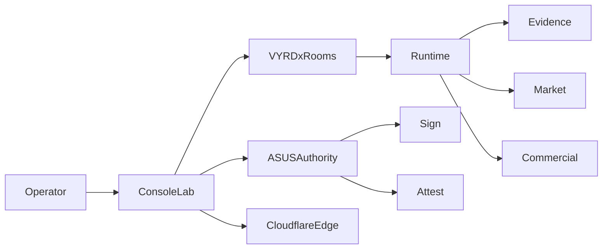

# ConsoleLab Control Flow Lock

Status: Locked
Date: 2026-03-11
Scope: ConsoleLab (ASUS internal), ASUS authority bridge, VYRDx runtime bridge

## Canonical Flow

## Service Mapping

- `ConsoleLab`
  - Frontend pages: `/home/t79/vyrdon/consolelab/frontend/src/pages`
  - Backend API: `/home/t79/vyrdon/consolelab/backend/src`
- `VYRDxRooms`
  - Control room pages and room surfaces inside ConsoleLab frontend
- `ASUSAuthority`
  - ASUS status/authority routes in ConsoleLab backend + ASUS authority services
- `CloudflareEdge`
  - Config path: `/home/t79/vyrdon/consolelab/ops/cloudflare`
- `Runtime`
  - Read-only runtime integration through backend services/routes
- `Evidence`
  - Backend evidence layer: `/home/t79/vyrdon/consolelab/backend/src/evidence`
- `Market`
  - Market telemetry/services wiring under backend services/telemetry
- `Commercial`
  - Commercial runtime room data shown through ControlRoom pages

## Enforcement Notes

- ConsoleLab is operator/control surface only.
- ASUS authority keeps sign/attest role; runtime execution stays outside ASUS authority node.
- Evidence is append-only and produced by backend evidence services.
- Cloudflare remains the edge boundary for external ingress.
