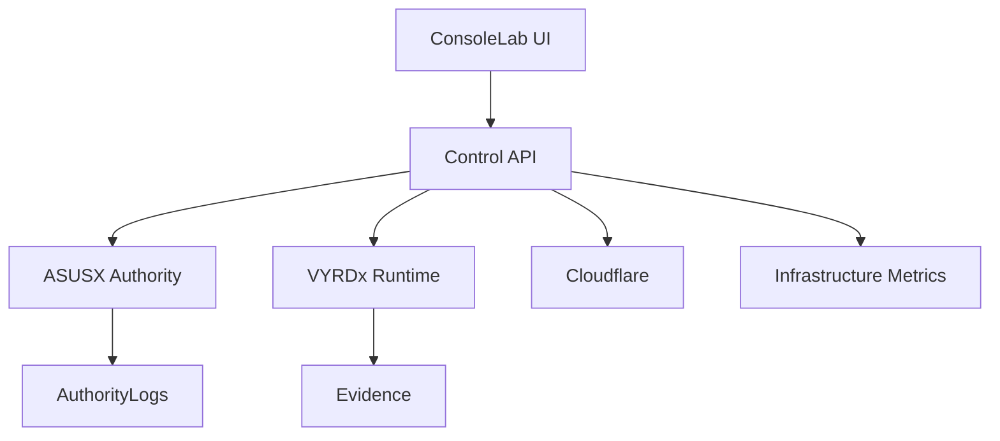

# Control Surface Topology

Status: Locked
Date: 2026-03-11

## Canonical Flow

## Runtime Mapping

- `ConsoleLab UI`:
  - `/home/t79/vyrdon/consolelab/frontend/src/App.jsx`
- `Control API`:
  - `/home/t79/vyrdon/consolelab/backend/src/index.js`
  - `/home/t79/vyrdon/consolelab/backend/src/routes/controlSurface.js`
- `ASUSX Authority`:
  - `/api/asusx/*`
- `VYRDx Runtime`:
  - `/api/vyrdox/*`
  - `/api/control-surface/runtime-bridge`
- `Cloudflare`:
  - `/home/t79/vyrdon/consolelab/ops/cloudflare`
- `Infrastructure Metrics`:
  - `/api/control-surface/telemetry-collector`
- `Evidence`:
  - `/api/control-surface/evidence-reader`
  - `ops/baselines/evidence/events.jsonl`
- `Authority Logs`:
  - ASUS authority room state and evidence references under `/home/t79/ASUS/ASUSX/control-room/rooms`

## API Topology Endpoint

- `GET /api/control-surface/topology`
