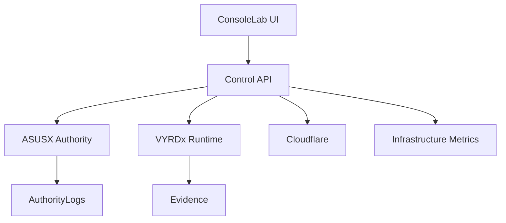

# ConsoleLab Production Push Lock

Status: LOCKED
Date: 2026-03-11
Scope: `/home/t79/vyrdon/consolelab`

## Required Tool Integrations

ConsoleLab must integrate and monitor:

- Cloudflare: access control, tunnel status, WAF-related edge posture
- PostgreSQL: internal platform state and audit indexing
- Redis: cache and runtime snapshots
- NATS or Kafka: event streaming from runtime engines
- Prometheus: service metrics
- Grafana: operational dashboard overlays
- Filesystem evidence store: seal and audit records

API endpoint:
- `GET /api/control-surface/integrations`

## Language Layout (Locked)

- Node.js:
  - API gateway
  - Cloudflare Access verification
  - Bridges to runtime and authority
- Python:
  - Analytics
  - Report generation
  - Reconciliation
  - Room aggregation logic
- Go (optional):
  - Infrastructure collectors
  - Host metrics agents
- Rust (optional):
  - Seal verification
  - Integrity checks

## Hostname Boundaries (Locked)

ConsoleLab:
- `consolelab.vyrdon.com`
- Protected by Cloudflare Access with SSO + MFA
- Must never share hostnames with product console

Product:
- `console.vyrdx.vyrdon.com`
- `api.vyrdx.vyrdon.com`

Authority:
- `sign.asusx.vyrdon.com`
- `attest.asusx.vyrdon.com`

API endpoint:
- `GET /api/control-surface/responsibilities`

## ConsoleLab Responsibilities (Must Do)

- Monitor authority
- Monitor runtime
- Review evidence
- Track commercial state
- Track market intelligence
- Supervise infrastructure
- Coordinate team execution

## ConsoleLab Must Not Do

- Run market engines
- Run commercial engines
- Run runtime jobs
- Write directly into runtime execution paths

## Deployment Boundary

- ConsoleLab runs on DELL as a separate service stack from VYRDx runtime
- ConsoleLab reads runtime state only through APIs/telemetry
- Runtime mutation from ConsoleLab is denied
- Evidence inspection reads sealed records instead of raw runtime logs
- Access is Cloudflare Access-gated with operator identity checks

## Enforced Topology

Related endpoints:
- `GET /api/control-surface/topology`
- `GET /api/control-surface/integrations`
- `GET /api/control-surface/responsibilities`
- `GET /api/control-surface/runtime-bridge`
- `GET /api/control-surface/evidence-reader`
- `GET /api/control-surface/telemetry-collector`
